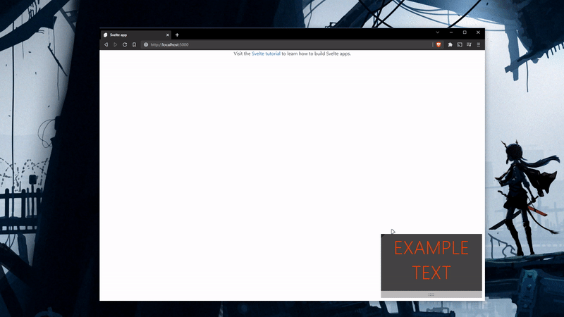

<h1 align="center">
	Svelte Miniplayer
</h1>
<p align="center">
  <br>
</p>

## Functions:
```jsx
import Miniplayer from 'svelte-miniplayer'

<Miniplayer active={true} padding="12rem" maxwidth="100%" width="200px" minwidth="10%" resize={true} position="top right" class="bg-dark">
```
- `padding` - CSS size unit, padding from the edges
- `maxwidth` - CSS size unit, max width of the container
- `width` - pixels, width of the container, optional, auto if container is not resizable
- `minwidth` - CSS size unit, min width of the container
- `resize` - Boolean, allows the container to be resizable
- `active` - Boolean, turns on/off the miniplayer functionality
- `position` - initial position corner of the miniplayer: top|bottom + left|right ex: `bottom right`

The draggable footer inherits background color and font color from the miniplayer class.

Simple usage:
```jsx
<Miniplayer active={true} padding="12rem" maxwidth="100%" width="200px" minwidth="10%" resize={true} position="top right" class="bg-dark">
	<video src={url} class="aspect-ratio-16/9"></video>
</Miniplayer>
```